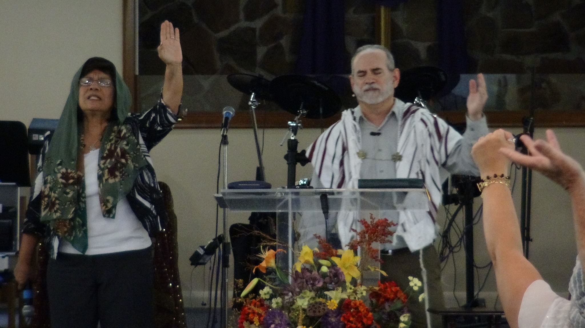

<header class="header">
  

   

		

			
			<h1 class="text-success display-2 mb-n3 pb-0 d-none d-sm-block">Tree of Life</h1>
			<h1 class="text-success display-4 mb-n3 pb-0 d-sm-none">Tree of Life</h1>
			<h2 class="text-secondary text-uppercase font-weight-lighter mt-n3 pt-0 d-none d-sm-block">Messianic Congregation</h2>
			<h5 class="text-secondary text-uppercase font-weight-lighter mt-n3 pt-0 d-sm-none">Messianic Congregation</h5>
		

   
  
</header>

	

		

		   

			 

			 
		   

		   

				

				<blockquote class="blockquote m-2">
				  
On each side of the river stood the tree of life, bearing twelve crops of fruit, yielding its fruit every month. And the leaves of the tree are for the healing of the nations.

				  <footer class="blockquote-footer text-uppercase">Revelations 22:2</footer>
				</blockquote>
		   

	   
  
   
  

	

		

		   

			 

			 
			 

		   

		   

		     <h1 class="d-none d-sm-block">Welcome Fellow Messianic Believers!</h1>
		     <h2 class="d-sm-none">Welcome Fellow Messianic Believers!</h2>
			 
I want to personally invite you to visit our congregation to experience the richness of Messianic Judaism. Messianic Judaism is not a new phenomenon; it began 2,000 years ago by Yeshua (Jesus), the promised Messiah of Israel. Enamored by this newly found faith, His talmidim (disciples) took this profound gift of redemption and shared it with all the other nations. Now, as Jews and non-Jews worshipping together, we can truly experience what Ephesians 2:14 says: “For He Himself is our shalom (peace), Who has made the two one.” It is in this unity, that we can see the power of the God of Abraham, Isaac, and Jacob manifest to miraculously touch the lives of those who trust in Him.

		   

	   
  
   
  

