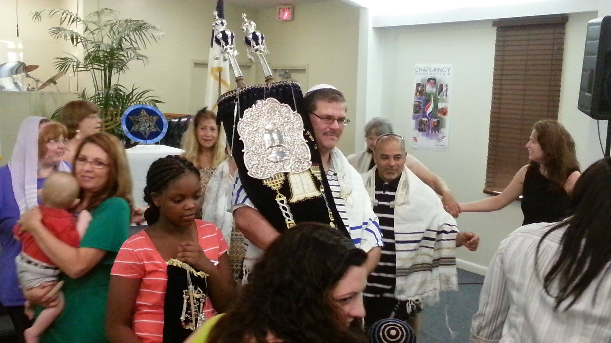

<header class="header">
  

   

		

			
			<h1 class="text-success display-2 mb-0 pb-0 d-none d-sm-block">Tree of Life</h1>
			<h1 class="text-success display-4 mb-0 pb-0 d-sm-none">Tree of Life</h1>
			<h2 class="text-secondary text-uppercase font-weight-lighter mt-0 pt-0 d-none d-sm-block">Messianic Congregation</h2>
			<h5 class="text-secondary text-uppercase font-weight-lighter mt-0 pt-0 d-sm-none">Messianic Congregation</h5>
		

   
  
</header>

   

    
   

   

    

       ipsum dolor sit amet, consectetur adipisicing elit, sed do eiusmod
     tempor incididunt ut labore et dolore magna aliqua. Ut enim ad minim veniam,
     quis nostrud exercitation ullamco laboris nisi ut aliquip ex ea commodo
     consequat. Duis aute irure dolor in reprehenderit in voluptate velit esse
     cillum dolore eu fugiat nulla pariatur. Excepteur sint occaecat cupidatat non
     proident, sunt in culpa qui officia deserunt mollit anim id est laborum.
    

   

  

